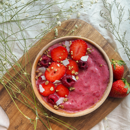
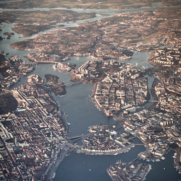
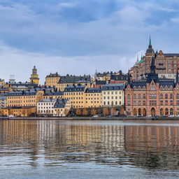
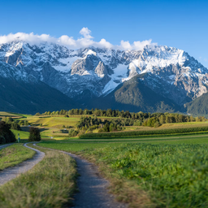
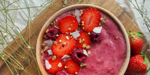
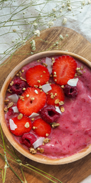
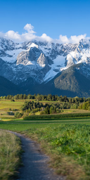
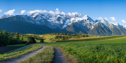
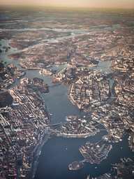

# snapcrop 🖼

Simple CLI utility for cropping large amounts images to a specified set of resolutions or aspect ratios.

Useful for dataset preperation for machine learning tasks.

Images will be matched to the nearest aspect ratio from your specified target resolutions, ensuring no distortion. The tool prioritizes the image's original aspect ratio during resizing and centers the content during cropping. Additionally, snapcrop avoids upscaling smaller images, preserving their original quality.

snapcrop uses the hash of the origninal input image to avoid reprocessing images, allowing incremental re-runs into the same output directiory (does not respect changes to the --res parameter, to avoid having to open the image and run resize logic to determine if we can skip).

## Features
- Resize and crop images based on a specified resolution.
- Supports a variety of input formats for resolution, from fixed sizes to ranges.
- Provides feedback through a progress bar.
- Outputs cropped images with unique names using the BLAKE3 hashing algorithm.
- Uses Lanczos3 convolution for high-quality resampling.

## Install

Crate
```
cargo install snapcrop
```

Github
```
git clone https://github.com/functorism/snapcrop.git
cd snapcrop
cargo build --release
```

## Examples and params

```
Crop all your images with snapping

Examples:

Crop images to SDXL training resolutions
    snapcrop out --res 1024x1024,1152x896,896x1152,1216x832,832x1216,1344x768,768x1344,1536x640,640x1536

Crop images to the closest resolution of the provided 1:1 sizes
    snapcrop out --res 1024,768,512

Crop images to the closest resolution of 1:1 aspect ratio between 512x512 and 1024x1024 with a step of 64
    snapcrop out --res 512:1024:64

Crop images with a fixed width of 512 and a height between 1024 and 512 with a step of 64
    snapcrop out --res 512:1024:64x512

Crop images to resolution in either orientation (512x768 and 768x512)
    snapcrop out --res [512x768]

Combine freely
    snapcrop out --res [512x768],1024,512:768:64x768:1024:32


Usage: snapcrop [OPTIONS] --res <RESOLUTIONS> <OUTPUT_PATH>

Arguments:
  <OUTPUT_PATH>
          Output dir path for images

Options:
      --res <RESOLUTIONS>
          List of resolutions

  -i, --input-file <IMAGE_LIST_PATH>
          File list path, stdin used otherwise

  -l, --log <LOG_PATH>
          Output debug info to log

  -v, --verbose
          Output debug info to stderr

  -f, --format <IMAGE_FORMAT>
          [default: png]

  -h, --help
          Print help (see a summary with '-h')
```

## Visual examples

```
snapcrop squares --res 256
```





```
snapcrop landscape --res 256x128
```



```
snapcrop portrait --res 128x256
```






```
snapcrop mixed --res 256,[128x256]
```




```
snapcrop steps --res [128:256:8x128:256:8]
```




## Dependencies
The main libraries this CLI uses are:

- fast_image_resize: For resizing the image.
- image: For handling different image formats.
- indicatif: For showing the progress bar.
- rayon: For parallel processing.
- clap: For command-line argument parsing.
- simplelog: For logging.
- blake3: For hashing the image content.